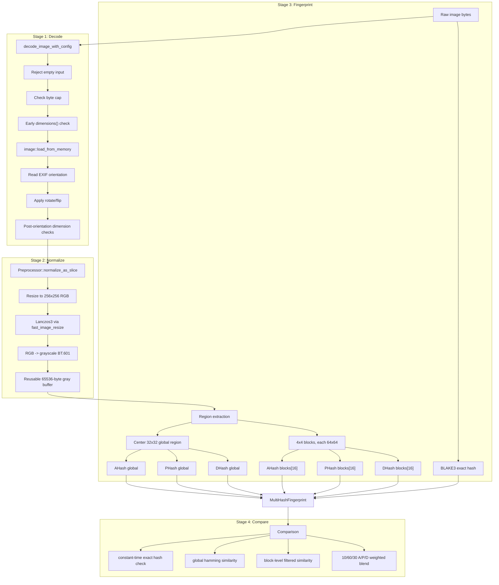
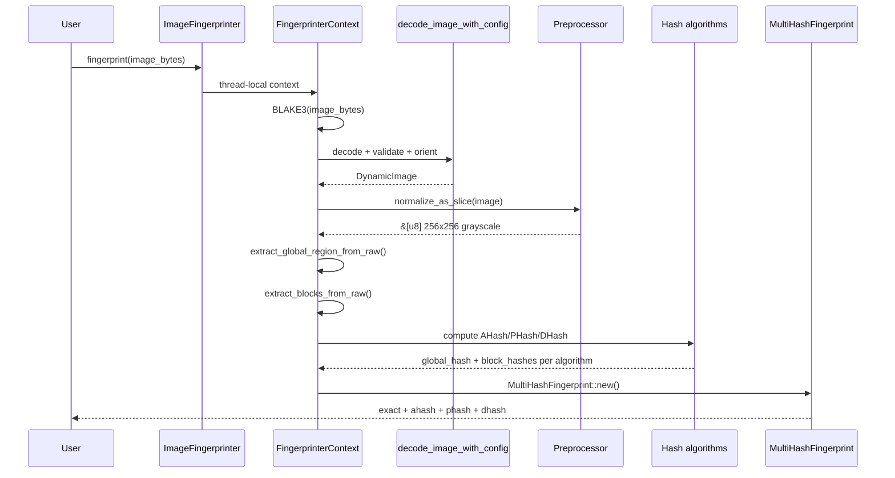
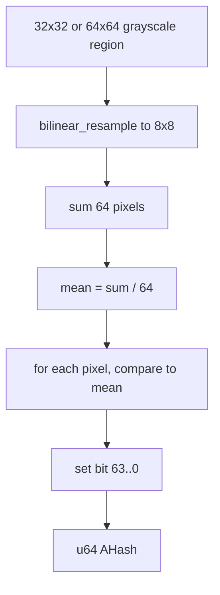
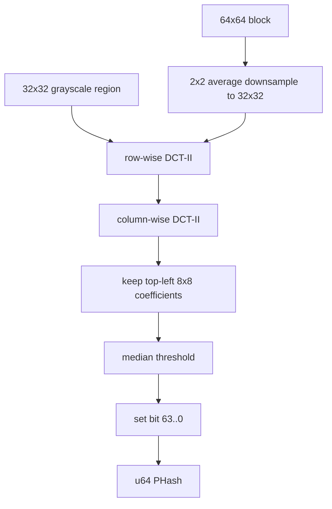
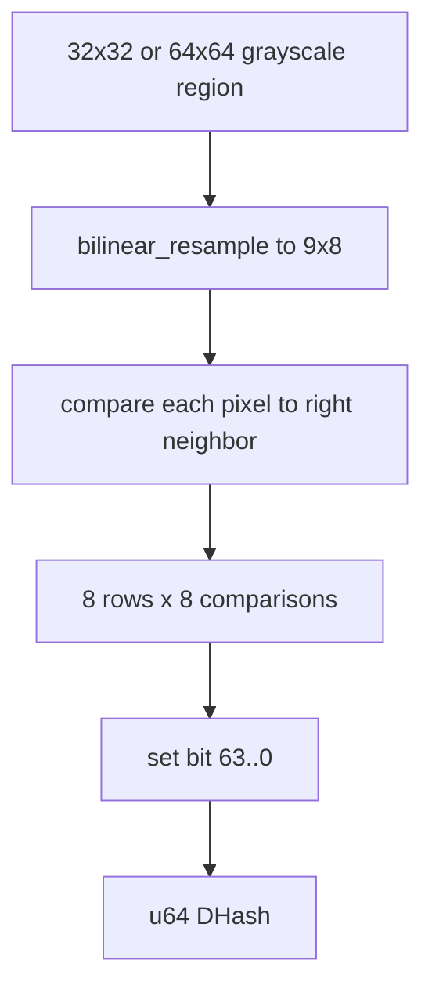
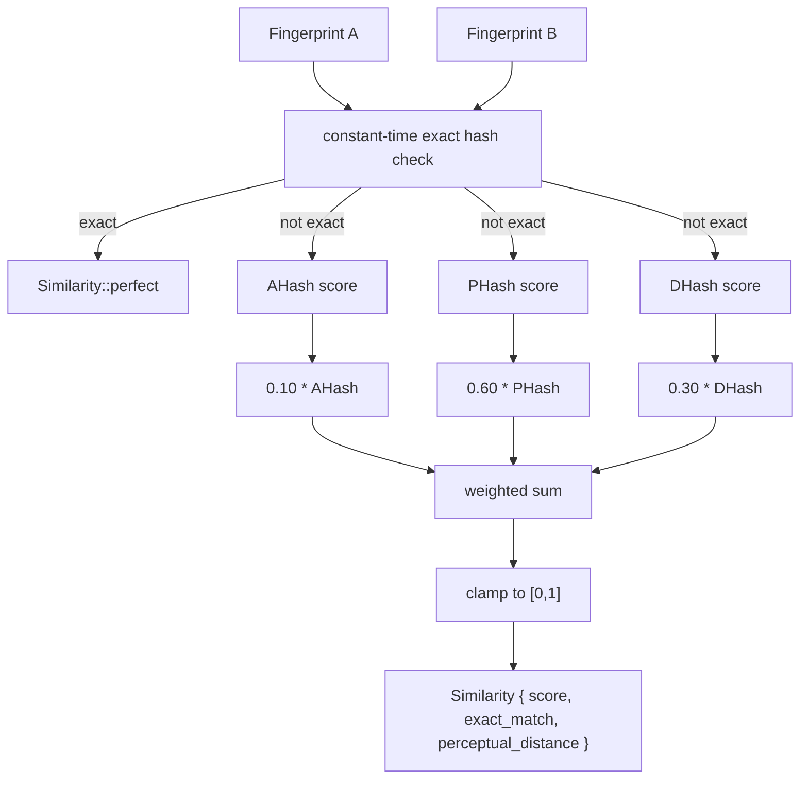

# imgfprint - Internal Architecture & Algorithm Reference

> This document is the **internal** engineering reference for `imgfprint`.
> It explains how image bytes move through the fingerprinting pipeline, how
> each hash algorithm works at the bit level, how comparison scores are built,
> and how the crate is organized. For the user-facing SDK guide, see
> [USAGE.md](USAGE.md).

---

## Table of Contents

1. [Project Overview](#project-overview)
2. [Architecture](#architecture)
3. [Core Algorithms](#core-algorithms)
   - [BLAKE3 Exact Hash](#1-blake3-exact-hash)
   - [AHash](#2-ahash-average-hash)
   - [PHash](#3-phash-dct-perceptual-hash)
   - [DHash](#4-dhash-difference-hash)
   - [MultiHash Scoring](#5-multihash-scoring)
   - [Semantic Embeddings](#6-semantic-embeddings)
4. [Data Structures & Memory Layouts](#data-structures--memory-layouts)
5. [Preprocessing Internals](#preprocessing-internals)
6. [Similarity Metrics](#similarity-metrics)
7. [Edge Cases & Invariants](#edge-cases--invariants)
8. [Module Map](#module-map)

---

## Project Overview

**imgfprint** is a Rust SDK (v0.4.3, edition 2021, MSRV 1.70) for extracting
compact, deterministic image fingerprints. It combines byte-exact hashing,
perceptual hashing, block-level crop resistance, and optional semantic
embeddings.

It serves:

- Exact image deduplication
- Perceptual duplicate detection across resize/compression/color changes
- Similarity search and content-based image retrieval
- Content moderation and media indexing
- Semantic image matching through CLIP-style embeddings

### Design Pillars

| Pillar | How |
|--------|-----|
| **Determinism** | Same input bytes + same config -> same fingerprint bytes. |
| **Byte stability** | `ImageFingerprint` and `MultiHashFingerprint` are `repr(C)` and `bytemuck::Pod`. |
| **Layered matching** | Exact BLAKE3 first, then perceptual hashes, then optional semantic vectors. |
| **Crop resistance** | Every perceptual algorithm stores a global hash plus 16 block hashes. |
| **Throughput** | Cached resize buffers, cached DCT FFT plan, thread-local context, optional rayon. |
| **Guarded decode** | Input byte cap, min/max dimension caps, EXIF orientation handling. |

---

## Architecture

### The Four-Stage Pipeline

Every perceptual fingerprint flows through four independent stages:

```text
input image bytes
    |
    v
+-------------------------------------------------+
| Stage 1: Decode                                 |
| format sniff -> image decode -> EXIF orientation |
+-------------------------------------------------+
    |
    v
+-------------------------------------------------+
| Stage 2: Normalize                              |
| resize 256x256 -> RGB -> BT.601 grayscale       |
+-------------------------------------------------+
    |
    v
+-------------------------------------------------+
| Stage 3: Fingerprint                            |
| BLAKE3 exact + AHash + PHash + DHash            |
+-------------------------------------------------+
    |
    v
+-------------------------------------------------+
| Stage 4: Comparison                             |
| exact match -> hamming -> block score -> blend  |
+-------------------------------------------------+
```

**Key principle**: decode and normalization are shared by all perceptual
algorithms. The pipeline extracts one global 32x32 region and one 4x4 grid of
64x64 blocks, then runs the selected hash algorithm over those buffers.

### Pipeline Flow Diagram



### Runtime Sequence (MultiHash path)



### Module Organization

```text
src/
├── lib.rs                    # Re-exports, FORMAT_VERSION
├── error.rs                  # ImgFprintError
├── core/
│   ├── mod.rs
│   ├── fingerprint.rs        # ImageFingerprint, MultiHashFingerprint, config
│   ├── fingerprinter.rs      # public API, context, batch, pipeline glue
│   └── similarity.rs         # hamming, block similarity, score assembly
├── hash/
│   ├── mod.rs
│   ├── algorithms.rs         # HashAlgorithm enum
│   ├── ahash.rs              # average hash
│   ├── phash.rs              # DCT perceptual hash
│   └── dhash.rs              # horizontal gradient hash
├── imgproc/
│   ├── mod.rs
│   ├── decode.rs             # image decode, EXIF orientation, guards
│   └── preprocess.rs         # resize, grayscale, extraction, resampling
└── embed/
    ├── mod.rs                # Embedding, EmbeddingProvider, cosine similarity
    └── local.rs              # optional ONNX local provider

docs/
└── WATERMARK_ARCHITECTURE.md # planned forensic watermarking design
```

---

## Core Algorithms

### 1. BLAKE3 Exact Hash

#### Purpose

The exact hash detects byte-identical images before perceptual comparison.
It is computed over the original input bytes for `fingerprint()` and
`fingerprint_with()`.

For `fingerprint_image(&DynamicImage)`, decode has already happened, so the
exact hash is computed over raw RGB8 pixel bytes instead.

#### Algorithm Walkthrough

```text
INPUT: encoded image bytes
HASH:  BLAKE3

Step 1 - Reset reusable hasher:
  exact_hasher.reset()

Step 2 - Feed original bytes:
  exact_hasher.update(image_bytes)

Step 3 - Finalize:
  exact = *exact_hasher.finalize().as_bytes()

Step 4 - Store:
  exact: [u8; 32]
```

#### Comparison

Exact hash comparison uses `subtle::ConstantTimeEq`:

```text
exact_match = ct_eq(a.exact, b.exact)

if exact_match:
  score = 1.0
  perceptual_distance = 0
else:
  continue with perceptual score
```

This is defense-in-depth for deployments where duplicate checks are exposed
over network boundaries.

#### Key Properties

- **Byte exact**: any metadata, encoding, or compression change changes the hash.
- **Fast**: BLAKE3 is used instead of SHA-2-family exact hashes.
- **Independent**: exact matching does not depend on decode success semantics.

---

### 2. AHash (Average Hash)

#### Theory

AHash captures coarse luminance structure by shrinking an image region to 8x8,
computing its mean brightness, and assigning one bit per pixel:

```text
bit[i] = 1 if pixel[i] >= mean else 0
```

It is the fastest perceptual algorithm, but it is less robust than PHash to
compression artifacts and frequency-level changes.

#### Algorithm Walkthrough

```text
INPUT: 32x32 grayscale float buffer in [0.0, 1.0]

Step 1 - Downsample:
  bilinear_resample(32x32 -> 8x8)

Step 2 - Mean:
  mean = sum(small[0..64]) / 64

Step 3 - Bits:
  hash = 0
  bit_pos = 63
  for y in 0..8:
    for x in 0..8:
      if small[y * 8 + x] >= mean:
        hash |= 1 << bit_pos
      bit_pos -= 1

Step 4 - Output:
  u64 perceptual hash
```

#### Block Path

For 64x64 blocks, AHash uses the same algorithm after direct downsampling:

```text
compute_ahash_from_64x64(block)
  -> bilinear_resample(64x64 -> 8x8)
  -> mean threshold
  -> u64
```

#### AHash Pipeline Diagram



#### Key Properties

- **Fastest**: only resampling, sum, and thresholding.
- **Brightness-relative**: global brightness shifts often preserve the bit pattern.
- **Coarse**: distinct images with similar average layout can collide.
- **Uniform image invariant**: all pixels equal to the mean produce `u64::MAX`.

---

### 3. PHash (DCT Perceptual Hash)

#### Theory

PHash represents image structure in the frequency domain. It computes a 2D
DCT-II over a 32x32 grayscale region, keeps the low-frequency 8x8 coefficient
block, and thresholds those 64 coefficients by their median.

Low frequencies capture broad shape and tone distribution, which makes PHash
more robust to compression and mild resizing than direct pixel thresholding.

#### DCT-II Implementation

The crate computes a 32-point DCT-II using a real FFT plan:

```text
DCT-II(x) = 2 * Re(exp(-j * pi * k / (2N)) * FFT(y))
```

where `y` is a permuted version of the input row/column. The FFT plan is cached
in a `OnceLock<Arc<dyn RealToComplex<f32>>>` so repeated PHash calls avoid
planner allocation.

#### Algorithm Walkthrough

```text
INPUT: 32x32 grayscale float buffer in [0.0, 1.0]

Step 1 - Row-wise DCT:
  for row in 0..32:
    dct2_32(row, col_buffer[row])

Step 2 - Column-wise DCT:
  for col in 0..8:
    collect col_buffer[0..32, col]
    dct2_32(column)
    keep rows 0..8

Step 3 - Low-frequency matrix:
  hash_matrix = 8x8 coefficients

Step 4 - Median threshold:
  median = nth_element(hash_matrix, 32)

Step 5 - Bits:
  bit i = 1 if coeff[i] >= median else 0
  bit order: bit 63 for coeff[0], down to bit 0

Step 6 - Output:
  u64 perceptual hash
```

#### NaN and Ordering Handling

`compute_hash_from_coeffs` has two paths:

```text
if any coefficient is NaN:
  sort indexed values deterministically
else:
  use select_nth_unstable_by(total_cmp) for O(n) median selection
```

The fallback keeps malformed floating-point states deterministic.

#### Block Path

For 64x64 blocks, PHash first downsamples by averaging each 2x2 pixel group:

```text
downsampled[y, x] =
  (block[2y, 2x]
 + block[2y, 2x + 1]
 + block[2y + 1, 2x]
 + block[2y + 1, 2x + 1]) / 4
```

Then it runs the same 32x32 DCT path.

#### PHash Pipeline Diagram



#### Key Properties

- **Most robust classical hash** in this crate for compression and resize noise.
- **More expensive** than AHash/DHash due to two DCT passes.
- **Plan-cached** through `OnceLock`.
- **Median-thresholded** so absolute scale matters less than coefficient rank.

---

### 4. DHash (Difference Hash)

#### Theory

DHash captures local horizontal gradients. It shrinks a region to 9x8, then
compares each pixel against its right neighbor:

```text
bit[y, x] = 1 if pixel[y, x] > pixel[y, x + 1] else 0
```

Nine columns produce eight comparisons per row, and eight rows produce 64 bits.

#### Algorithm Walkthrough

```text
INPUT: 32x32 grayscale float buffer in [0.0, 1.0]

Step 1 - Downsample:
  bilinear_resample(32x32 -> 9x8)

Step 2 - Gradient bits:
  hash = 0
  bit_pos = 63
  for y in 0..8:
    for x in 0..8:
      left = small[y * 9 + x]
      right = small[y * 9 + x + 1]
      if left > right:
        hash |= 1 << bit_pos
      bit_pos -= 1

Step 3 - Output:
  u64 perceptual hash
```

#### Block Path

For 64x64 blocks, DHash directly resamples to 9x8 and runs the same gradient
comparison.

#### DHash Pipeline Diagram



#### Key Properties

- **Gradient-based**: good at retaining simple structural direction changes.
- **Fast**: resampling plus 64 adjacent comparisons.
- **Uniform image invariant**: equal neighbors produce hash `0`.
- **Orientation-sensitive**: horizontal comparison is affected by rotation/flip.

---

### 5. MultiHash Scoring

#### Purpose

`MultiHashFingerprint` combines the strengths of AHash, PHash, and DHash. Each
algorithm contributes:

- one global hash from the center 32x32 region
- sixteen 64x64 block hashes from a 4x4 grid

The default blend is:

```text
AHash: 10%
PHash: 60%
DHash: 30%
```

Within each algorithm:

```text
global hash score: 40%
block hash score:  60%
```

#### Per-Algorithm Similarity

```text
global_distance = popcnt(a.global_hash XOR b.global_hash)
global_similarity = 1.0 - global_distance / 64

for each block i in 0..16:
  distance = popcnt(a.blocks[i] XOR b.blocks[i])
  if distance <= block_distance_threshold:
    include 1.0 - distance / 64

block_similarity = average(included block similarities)
score = global_weight * global_similarity + block_weight * block_similarity
```

The default block threshold is 32. Blocks farther apart than that are ignored
instead of dragging the crop-resistant score down.

#### Multi-Algorithm Blend

```text
score =
    ahash_score * ahash_weight
  + phash_score * phash_weight
  + dhash_score * dhash_weight

score = clamp(score, 0.0, 1.0)
```

Weights live in `MultiHashConfig` and do not need to sum to 1.0. Setting an
algorithm weight to `0.0` removes it from the score.

#### Comparison Diagram



#### Key Properties

- **Exact match short-circuit**: byte-identical inputs always score 1.0.
- **Configurable**: algorithm weights, global/block weights, and block threshold are tunable.
- **Crop-aware**: valid block matches contribute even if other blocks are missing or unrelated.
- **Distance reporting**: `perceptual_distance` is weighted average global Hamming distance.

---

### 6. Semantic Embeddings

#### Purpose

Classical hashes describe visual structure. Semantic embeddings describe image
meaning. `imgfprint` defines the shared data model and comparison function while
letting callers provide the model/API implementation.

#### Types

```text
Embedding
├── vector: Vec<f32>
└── model_id: Option<String>

EmbeddingProvider
└── embed(image: &[u8]) -> Result<Embedding, ImgFprintError>
```

Embeddings are validated on construction:

- vector must be non-empty
- every element must be finite
- vector must not be all zeros

#### Semantic Similarity

```text
if both model_id values exist and differ:
  error: InvalidEmbedding

if dimensions differ:
  error: EmbeddingDimensionMismatch

dot = sum(a[i] * b[i])
norm_a = sqrt(sum(a[i]^2))
norm_b = sqrt(sum(b[i]^2))

similarity = dot / (norm_a * norm_b)
```

For normalized CLIP-style vectors, cosine similarity is usually in `[0.0, 1.0]`.
For arbitrary vectors, it can be in `[-1.0, 1.0]`.

---

## Data Structures & Memory Layouts

### ImageFingerprint

```text
ImageFingerprint - repr(C), bytemuck::Pod

+------------------------------+----------+
| field                        | size     |
+------------------------------+----------+
| exact: [u8; 32]              | 32 bytes |
| global_hash: u64             | 8 bytes  |
| block_hashes: [u64; 16]      | 128 bytes|
+------------------------------+----------+
| total                        | 168 bytes|
+------------------------------+----------+
```

An `ImageFingerprint` is a single-algorithm fingerprint. The perceptual
algorithm is not stored in the struct, so callers must know whether the value
came from AHash, PHash, or DHash when storing single-algorithm fingerprints.

### MultiHashFingerprint

```text
MultiHashFingerprint - repr(C), bytemuck::Pod

+------------------------------+----------+
| field                        | size     |
+------------------------------+----------+
| exact: [u8; 32]              | 32 bytes |
| ahash: ImageFingerprint      | 168 bytes|
| phash: ImageFingerprint      | 168 bytes|
| dhash: ImageFingerprint      | 168 bytes|
+------------------------------+----------+
| total                        | 536 bytes|
+------------------------------+----------+
```

The outer `exact` is duplicated inside each per-algorithm `ImageFingerprint`.
Production constructors keep those exact hashes identical.

### Layout Stability

`src/core/fingerprint.rs` contains compile-time size assertions:

```rust
const _: () = {
    assert!(core::mem::size_of::<ImageFingerprint>() == 168);
    assert!(core::mem::size_of::<MultiHashFingerprint>() == 536);
};
```

`FORMAT_VERSION` in `src/lib.rs` is currently `1`. Persist it beside stored
fingerprints and refuse comparison across incompatible versions.

### MultiHashConfig

```text
MultiHashConfig
├── ahash_weight: f32                 default 0.10
├── phash_weight: f32                 default 0.60
├── dhash_weight: f32                 default 0.30
├── global_weight: f32                default 0.40
├── block_weight: f32                 default 0.60
└── block_distance_threshold: u32     default 32
```

This struct controls scoring only. It does not change the fingerprint bytes.

---

## Preprocessing Internals

### Decode Guards

`PreprocessConfig` controls decode-time safety:

```text
DEFAULT_MAX_INPUT_BYTES = 50 MiB
DEFAULT_MAX_DIMENSION   = 8192
DEFAULT_MIN_DIMENSION   = 32
```

The byte cap is enforced before decode. For path APIs, file metadata is checked
before reading the file into memory. Dimension caps are checked before full
decode when possible, after decode, and after EXIF orientation.

### EXIF Orientation

JPEG orientation metadata is read via `kamadak-exif`. Valid orientation values
1 through 8 are mapped to rotate/flip transforms:

```text
1: none
2: flip horizontal
3: rotate 180
4: flip vertical
5: rotate 90 then flip horizontal
6: rotate 90
7: rotate 270 then flip horizontal
8: rotate 270
```

This makes camera photos compare by visual orientation rather than raw encoded
orientation flags.

### Normalize to 256x256 Grayscale

`Preprocessor::normalize_as_slice` performs the hot-path normalization:

```text
DynamicImage
  -> RGB8 source view or owned RGB8 conversion
  -> fast_image_resize Lanczos3 to 256x256 RGB
  -> BT.601 grayscale conversion
  -> borrowed &[u8] buffer of 65536 pixels
```

BT.601 integer luma:

```text
Y = (77 * R + 150 * G + 29 * B) >> 8
```

The preprocessor owns reusable RGB and grayscale buffers to reduce allocation
pressure in batch pipelines.

### Region Extraction

From the normalized 256x256 grayscale image:

```text
global region:
  center crop, 32x32 pixels
  start_x = 112
  start_y = 112

block regions:
  4x4 grid
  each block = 64x64 pixels
  block index = block_y * 4 + block_x
```

Both extraction paths convert bytes to `f32` in `[0.0, 1.0]`.

### CPU Feature Handling

`fast_image_resize::Resizer` is configured with cached CPU extensions:

```text
x86_64:
  AVX2 if available
  else SSE4.1 if available
  else None

aarch64:
  NEON

other:
  None
```

The unsafe `set_cpu_extensions` call is guarded by runtime feature detection or
target architecture checks.

---

## Similarity Metrics

### Hamming Distance

All classical perceptual hashes are 64-bit values:

```text
distance = popcnt(a XOR b)
```

Rust's `u64::count_ones()` maps to hardware POPCNT on modern targets.

### Hash Similarity

```text
hash_similarity(distance):
  if distance >= 64:
    0.0
  else:
    1.0 - distance / 64.0
```

| Hamming distance | Similarity |
|------------------|------------|
| 0                | 1.00       |
| 8                | 0.875      |
| 16               | 0.75       |
| 32               | 0.50       |
| 48               | 0.25       |
| 64               | 0.00       |

### Block Similarity

For each of the 16 block hashes:

```text
distance = hamming_distance(a[i], b[i])

if distance <= max_distance:
  include hash_similarity(distance)
else:
  ignore this block
```

If no blocks are included, block similarity is `0.0`.

### Similarity Struct

```text
Similarity
├── score: f32                 # 0.0 to 1.0
├── exact_match: bool          # true for identical exact hashes
└── perceptual_distance: u32   # global Hamming distance summary
```

`Similarity::perfect()` returns:

```text
score = 1.0
exact_match = true
perceptual_distance = 0
```

---

## Edge Cases & Invariants

### Decode and Input Invariants

- Empty byte slices are rejected.
- Inputs above `PreprocessConfig::max_input_bytes` are rejected.
- Images smaller than `min_dimension` are rejected.
- Images larger than `max_dimension` are rejected.
- `min_dimension > max_dimension` is rejected as invalid config.
- Unsupported/corrupt formats map into `ImgFprintError` variants instead of panics.

### Preprocessing Invariants

- Normalized image size is always 256x256 grayscale.
- Global region is always 32x32.
- Block grid is always 4x4.
- Each block is always 64x64.
- Extracted float buffers are scaled by `1.0 / 255.0`.

### Hash Invariants

- AHash, PHash, and DHash each produce exactly 64 bits.
- Bit order is MSB to LSB for top-left to bottom-right traversal.
- AHash uses `>= mean`; uniform images produce all ones.
- DHash uses strict `left > right`; uniform horizontal rows produce zero bits.
- PHash uses deterministic `total_cmp` ordering for median selection.
- PHash block path downsamples 64x64 to 32x32 by 2x2 averaging.

### Comparison Invariants

- Exact-match fingerprints always compare to score `1.0`.
- Hamming distances are bounded by 64 for each hash.
- Score outputs are clamped to `[0.0, 1.0]`.
- Invalid thresholds in `is_similar` debug-assert in debug builds and clamp in release.
- `MultiHashConfig` weights may be zero; zero total algorithm weight produces distance `0`.

### Layout Invariants

- `ImageFingerprint` must remain 168 bytes.
- `MultiHashFingerprint` must remain 536 bytes.
- Both are `repr(C)`, `Pod`, and `Zeroable`.
- `FORMAT_VERSION` must change if stored bytes become semantically incompatible.

---

## Module Map

### Public API Surface

```text
lib.rs
├── FORMAT_VERSION
├── ImageFingerprinter
├── FingerprinterContext
├── ImageFingerprint
├── MultiHashFingerprint
├── MultiHashConfig
├── HashAlgorithm
├── Similarity
├── PreprocessConfig
├── decode_image / decode_image_with_config
├── Embedding / EmbeddingProvider
└── semantic_similarity
```

### `core::fingerprinter`

Responsibilities:

- Owns the end-to-end fingerprinting pipeline.
- Provides thread-local shared context for static API calls.
- Provides `FingerprinterContext` for buffer reuse in high-throughput callers.
- Computes exact hash, decode, normalize, extraction, hash algorithms, and constructors.
- Provides batch and chunked batch entry points.

Important paths:

```text
ImageFingerprinter::fingerprint()
  -> SHARED_CTX.with(...)
  -> FingerprinterContext::fingerprint()
  -> compute_all_hashes()

FingerprinterContext::compute_all_hashes()
  -> exact BLAKE3
  -> decode_image_with_config()
  -> normalize_as_slice()
  -> extract_global_region_from_raw()
  -> extract_blocks_from_raw()
  -> compute_ahash_data()
  -> compute_phash_data()
  -> compute_dhash_data()
  -> MultiHashFingerprint::new()
```

### `core::fingerprint`

Responsibilities:

- Defines stable fingerprint structs.
- Defines `MultiHashConfig` and default scoring constants.
- Implements accessors and display formatting.
- Implements single and multi-hash comparison methods.
- Enforces binary layout sizes at compile time.

### `core::similarity`

Responsibilities:

- Hamming distance and hash similarity.
- Single-algorithm global/block scoring.
- Block filtering by maximum distance.
- Constant-time exact hash check for single fingerprints.
- `Similarity` output type.

This module is written with `core` primitives plus `subtle`, so comparison logic
stays lightweight for consumers that only compare stored fingerprints.

### `hash`

Responsibilities:

- `algorithms.rs`: public `HashAlgorithm` enum.
- `ahash.rs`: average brightness threshold hash.
- `phash.rs`: DCT-based hash with cached FFT plan.
- `dhash.rs`: horizontal gradient hash.

All algorithms return a `u64` and share MSB-first bit ordering.

### `imgproc`

Responsibilities:

- `decode.rs`: format decode, EXIF orientation, byte and dimension guards.
- `preprocess.rs`: 256x256 resize, grayscale conversion, region extraction,
  block extraction, bilinear resampling helper, CPU extension selection.

### `embed`

Responsibilities:

- Validated embedding vector type.
- Optional model IDs to prevent incompatible comparisons.
- Provider trait abstraction.
- Cosine similarity implementation.
- Optional local ONNX provider behind `local-embedding`.

---

## End-to-End Example Trace

```text
Input:
  "photo.jpg" bytes

Decode:
  byte cap OK
  dimensions OK
  image::load_from_memory -> DynamicImage
  EXIF orientation 6 -> rotate90

Normalize:
  resize oriented image to 256x256 RGB
  convert to grayscale with BT.601 luma

Extract:
  global_region = center 32x32
  blocks = 16 regions of 64x64

Hash:
  exact = BLAKE3(original bytes)
  ahash.global = AHash(global_region)
  phash.global = PHash(global_region)
  dhash.global = DHash(global_region)
  ahash.blocks[0..16] = AHash(each block)
  phash.blocks[0..16] = PHash(each block)
  dhash.blocks[0..16] = DHash(each block)

Output:
  MultiHashFingerprint {
    exact,
    ahash: ImageFingerprint { exact, global_hash, block_hashes },
    phash: ImageFingerprint { exact, global_hash, block_hashes },
    dhash: ImageFingerprint { exact, global_hash, block_hashes },
  }
```

---

## Practical Tuning Notes

### Prefer default MultiHash for general dedup

The default 10/60/30 AHash/PHash/DHash blend is the broadest classical signal.
Use it for unknown image corpora unless you have measured a corpus-specific
reason to bias the score.

### Use PHash-only scoring when compression dominates

```rust
use imgfprint::{MultiHashConfig, DEFAULT_BLOCK_DISTANCE_THRESHOLD};

let cfg = MultiHashConfig {
    ahash_weight: 0.0,
    phash_weight: 1.0,
    dhash_weight: 0.0,
    global_weight: 0.4,
    block_weight: 0.6,
    block_distance_threshold: DEFAULT_BLOCK_DISTANCE_THRESHOLD,
};
```

This keeps the same fingerprint bytes and only changes comparison behavior.

### Tighten decode guards on untrusted ingress

```rust
use imgfprint::PreprocessConfig;

let cfg = PreprocessConfig {
    max_input_bytes: 1 * 1024 * 1024,
    max_dimension: 2048,
    ..PreprocessConfig::default()
};
```

The same config applies to pre-read file checks and decode-time checks.

### Use FingerprinterContext in loops

`ImageFingerprinter` uses a thread-local context for convenience. Long-running
batch jobs should use `FingerprinterContext` directly so ownership and reuse are
explicit at the call site.

